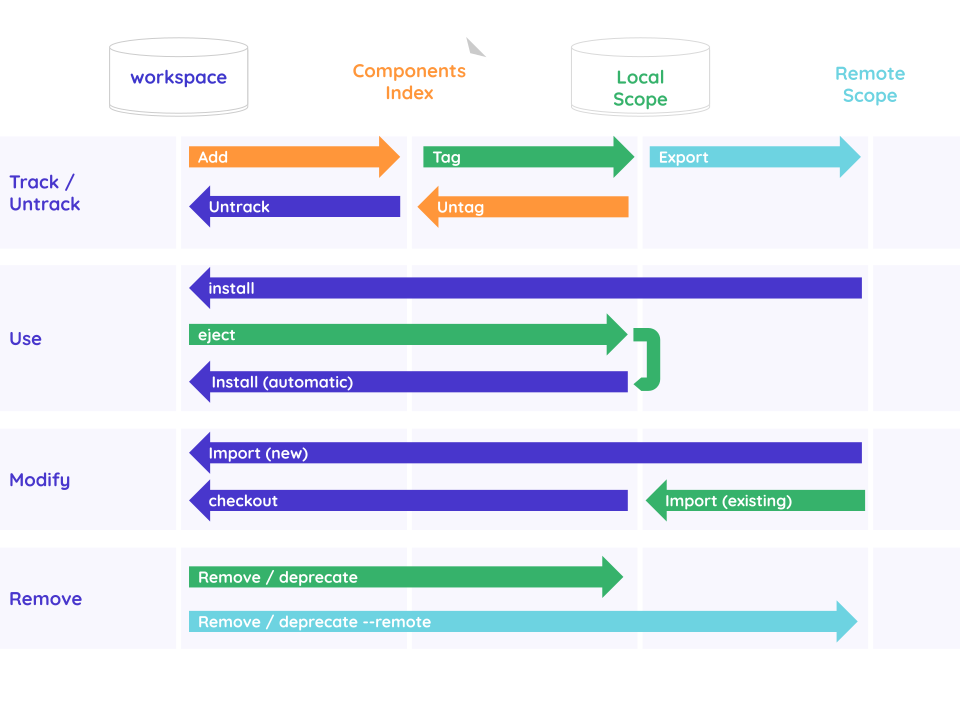

# Bit

Bit is a platform for collaboration on atomic components. In other words, it helps breaking components of a design library or project into standalong packages that can be individually versioned and shared. 

Practically, it is kind of similar to using Git.


## Core Concepts

A Bit component is a reusable piece of code, such as:

- A React component
- Shared stylesheet (CSS)
- Utility function used by the application.

From what I see, the UI component appears to be the most popular ones. 


### Elements of a Bit component

Each Bit component stores three elements:

- The **source code** of the component (e.g., JSX file of a React component), along with necessary styling files and assets
- **Dependency graph**. Bit can analyze all dependencies (i.e., `import` and `require` statements) to create a model of all dependencies of the component. This dependency graph makes the components self-contained.
  - NPM packages
  - Bit components installed in node_modules
  - Bit components imported into the workspace
  - Bit components created locally from local files
- **Tools and configurations.** These tools take component source code and its dependency graph to generate some desired results


### Component ID

In general, component ID is similar to how it is arranged inside folders:

```sh
owner.collection/namespace/namespace/short-id
```

When using package managers, the name is transformed to the following format:

```sh
@registry-name.owner.collection.namespace.namespace.short-id
```

To import component:

```js
import { something } from '@bit/owner.collection.namespace.namespace.short-id';
```


### Workspace

Bit creates a workspace inside a working project when running `bit init`. This is similarly to `git init` which turns a folder into a workspace managed by `git`. 

The workspace has:

- **Workspace configuration** stores information about the project that contains the Bit components, such as the package manager, compilers, and tester. This information is stored under the `bit` section of the `package.json` or a separated `bit.json` file. 
- **Component index** defines the files that comprises each component. It is stored in the `.bitmap` file. This is kind of similar to the hidden `.git` folder. 


### Lifecycle of a Bit component

1. **Producing components**
   1. **Track**: Declare the files in the workspace that comprises the component to Bit. Similar to `git add`
   2. **Version**: Tagging a version seals the content of the file and metadata under this version. Similar to `git commit`
   3. **Export**: Assigning the tagged component with a unique ID and send a copy of the files and metadata to the remote server. Similar to `git push`
2. **Consuming components**
   1. **Install**: After a Bit component has been published, it can be installed in remote workspaces. This can be done using `bit install`, `nom install`, or `yarn add`. Noted that modification to the installed components is not tracked by Bit. 
   2. **Import**: `bit import` add the source code of the component to the workspace component folder and track its modifications. This allows us to keep track of the changes to the components and push them back to the remote server. 



